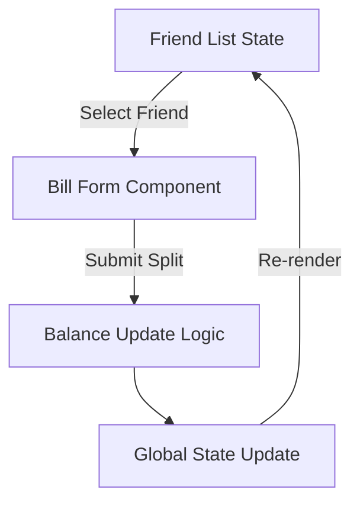

<div align="center">

# 🍽️ Eat-n-Split  
### Split expenses with friends effortlessly | Modern React Application

[](https://opensource.org/licenses/MIT)
[](https://airbnb.io/javascript/react/)


[](https://ihsansaif313.github.io/Eat-n-Split/)   
• [Report Bug](https://github.com/ihsansaif313/Eat-n-Split/issues) 
• [Request Feature](https://github.com/ihsansaif313/Eat-n-Split/issues)


</div>


## Features ✨

- **Friend Management**
  - 📝 Add new friends with avatars
  - 👥 Track multiple friendship balances
  - 🔄 Toggle between friend list and add form

- **Expense Splitting**
  - 💸 Split bills with selected friends
  - ⚖️ Choose who pays (you or friend)
  - 📊 Automatic balance calculation
  - 💰 Real-time balance updates

- **User Experience**
  - 🎨 Clean and intuitive UI
  - 📱 Responsive design
  - 🚫 Input validation
  - 🌈 Color-coded balance statuses

## Installation 🛠️

```bash
git clone https://github.com/ihsansaif313/Eat-n-Split.git
cd Eat-n-Split
npm install
npm run dev
```


## 🌟 Key Features

| Category          | Features                                                                                  |
|-------------------|-------------------------------------------------------------------------------------------|
| **Friends**       | 📌 Add/Remove friends • 👥 Group management • 📊 Balance tracking • 🎭 Avatar customization |
| **Expenses**      | 💸 Split bills • ⚖️ Payer selection • 🧮 Automatic calculations • 📈 Expense history       |
| **User Experience** | 🎨 Modern UI • 📱 Responsive design • 🌓 Light/Dark themes • 🚀 Instant updates          |
| **Security**      | 🔒 Local storage • 🛡️ Data validation • 📉 Balance safeguards • ⚡ Error boundaries        |

```bash
# Quick Start
git clone https://github.com/your-username/Eat-n-Split.git
cd Eat-n-Split
npm install
npm run dev
```
### State Management Flow

